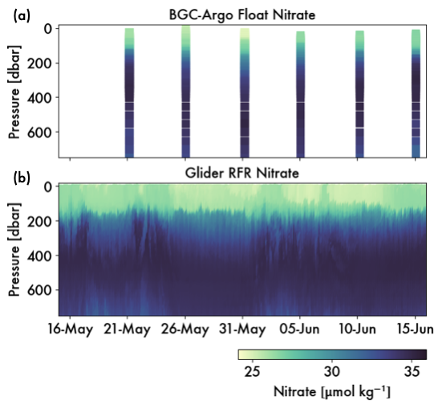

# Random forest regression on multi-platform in-situ ocean observations

Paper submitted to AMS Artifical Intelligence in Earth Sciences (AIES) May 2024 \
[Link to pre-print](https://doi.org/10.22541/essoar.171707849.91867565/v1)

Contact: Song Sangmin <sangsong@uw.edu> \
University of Washington, School of Oceanography

Last updated: May 30 2024

## Overview

Here, we use a regional random forest regression (RFR) to leverage data from multiple ocean observing instruments that offer different advantages. In our study of the Southern Ocean, we use RFR to produce new nutrient maps at 50 times higher resolution than previously possible. By estimating small-scale information, RFR reveals interactions between physical and biological processes during rapid mixing events that are normally difficult to observe. These short-lived interactions appear to be important in determining local nutrient content and therefore biological activity in this important ocean basin. 

Figure: Increasing the resolution of Southern Ocean nitrate maps with RFR.
)

Given increasing observational coverage of the global oceans by Argo floats and other drifting profilers, RFR presents opportunities to derive additional value from these sometimes incomplete biogeochemical datasets. Such efforts to bridge observational gaps using new ocean technologies and machine learning techniques will expand our knowledge of global biogeochemical cycles at previously inaccessible scales.

## RFR Notebooks

<!-- Three main notebooks describe the (1) Random Forest model development, (2) application to ocean data and performance evaluation, followed by (3) scientific analysis of the output. 
 -->

[Main Training Notebook](scripts/Training_RandomForest.ipynb) `scripts/Training_RandomForest.ipynb`

- Demonstrates our machine learning approach to ocean nutrient regression.
- Specifically, we go through these main steps: 

    1) Preparing BGC-Argo data for our model training data.
    2) Training the model on available BGC-Argo and shipboard data. 
    3) Validating different models to select optimal parameters; Cross-validating to minimize overfitting.
    4) Testing the RFR for error estimation; comparing with other algorithms
    5) Applying Seaglider inputs to predict new nitrate distributions. 

To run locally, install the environment `mlsogos` using the file `./binder/environment.yml`.

### Folder Directory

- `scripts/` : code for analysis
- `data/` : float, ship, and glider data as downloaded
- `working-vars/` : calculated output variables from analysis
- `images/` : final output figures

### Data Sources

- Description of glider data variables are in `./data/Seaglider_DataGuide.pdf`
- Description of Argo float and ship are in first paper from SOGOS program: [Link to Dove et. al. (2021)](https://agupubs.onlinelibrary.wiley.com/doi/10.1029/2021JC017178)

The SOGOS data for Seagliders SG659 and SG660 can be accessed through [Balwada 2023](https://doi.org/10.5281/zenodo.8361656). Argo float data were collected and made freely available by the International Argo Program and the national programs that contribute to it (https://argo.ucsd.edu, https://www.ocean-ops.org). The Argo Program is part of the Global Ocean Observing System; Argo float data and metadata from Global Data Assembly Centre ([Argo 2021](https://doi.org/10.17882/42182)). Shipboard data were collected and made publicly available by the International Global Ship-based Hydrographic Investigations Program (GO-SHIP; http://www.go-ship.org/) and the national programs that contribute to it. The satellite altimetry data are freely available through the E.U. Copernicus Marine Environment Monitoring Service (CMEMS; DOI 10.48670/moi-00148), and the value-added FSLE product is provided by AVISO (https://www.aviso.altimetry.fr/en/data/products/value-added-products/fsle-finite-size-lyapunov-exponents.html; DOI 10.24400/527896/a01-2022.002). MODIS-Aqua satellite data are hosted by NOAA and provided through the NASA Ocean Biology Processing Group (https://coastwatch.pfeg.noaa.gov/erddap/griddap/erdMH1par08day.html). 

- [Link to altimetry (ADT, EKE) data:](https://data.marine.copernicus.eu/product/SEALEVEL_GLO_PHY_L4_MY_008_047/download) (Global Ocean Gridded L 4 Sea Surface Heights And Derived Variables Reprocessed 1993 Ongoing)
- [Altimetry product doi: (https://doi.org/10.48670/moi-00148)
- [Link to float data](https://uwnetid-my.sharepoint.com/:f:/g/personal/sangsong_uw_edu/Es-ESkVfIlpHhpFq7o5LTaoBtqv6pWj6rntxMyXieLEq8A?e=FeRRjs)
- [Link to GO-SHIP I06 Bottle Data](https://cchdo.ucsd.edu/cruise/325020190403)

### Acknowledgments

This work is supported by NSF awards OCE-1756956 and OCE-1756882. SS and ARG are also supported by NASA award NNX80NSSC19K1252, the U.S. Argo Program through NOAA award NA20OAR4320271, NSF award OCE-2148434, and NSF’s Southern Ocean Carbon and Climate Observations and Modeling (SOCCOM) project through award OPP-1936222. PDL was supported by the NOAA grant NA19NES4320002 (Cooperative Institute for Satellite Earth System Studies, CISESS) at the University of Maryland/ESSIC. We thank Geoff Shilling and Craig Lee at APL for their efforts in reprocessing of the glider data. We also extend sincere thanks to Yuichiro Takeshita for offering his insights and code for processing the glider oxygen optode lags. We use colormaps obtained from the cmocean package ([Thyng et al. 2016]{https://doi.org/10.5670/oceanog.2016.66}). 

